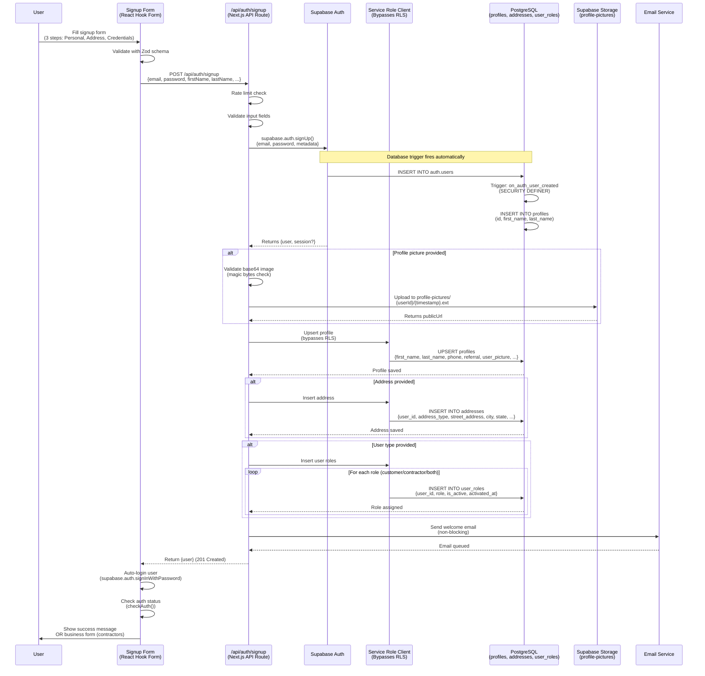
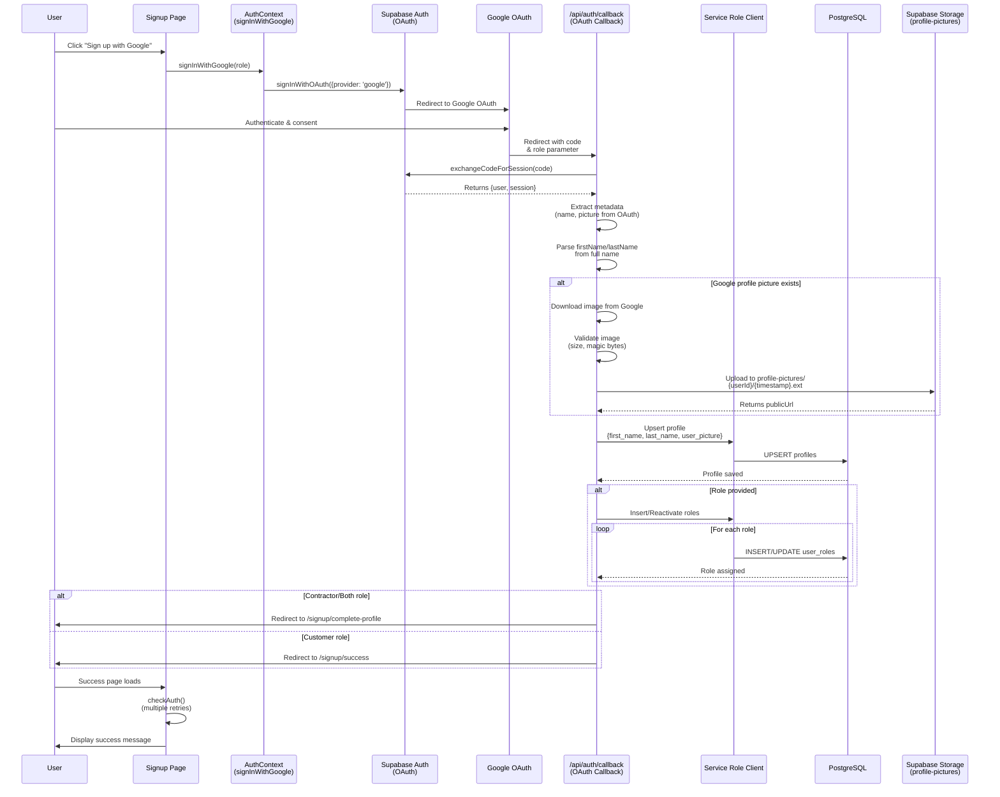

# Sign Up Process Flow

This document visualizes the complete signup process including Supabase interactions, database operations, and storage handling.

## Flow Overview

There are two main signup paths:
1. **Email/Password Signup** - Traditional form-based signup
2. **OAuth Signup** - Google OAuth signup

---

## 1. Email/Password Signup Flow



### Key Components

#### Step 1: User Fills Form
- **Location**: `app/[locale]/(auth)/signup/page.tsx`
- **Hook**: `app/[locale]/(auth)/signup/hooks/useSignupForm.ts`
- **Schema**: `lib/schemas/auth.ts` (Zod validation)
- Form has 3 steps:
  1. Personal Info (firstName, lastName, referral)
  2. Address Info (streetAddress, city, state, zipCode)
  3. Credentials (email, password)

#### Step 2: API Processing
- **Endpoint**: `app/api/auth/signup/route.ts`
- Validates all input
- Creates user via Supabase Auth
- Uploads profile picture (if provided) to Supabase Storage
- Creates/updates profile in database
- Saves address to `addresses` table
- Assigns roles to `user_roles` table
- Sends welcome email (non-blocking)

#### Step 3: Database Operations
- **Trigger**: `handle_new_user()` function (in `supabase/migrations/001_create_profiles.sql`)
- Automatically creates basic profile when user is inserted into `auth.users`
- Uses `SECURITY DEFINER` to bypass RLS policies
- API uses Service Role Client to bypass RLS for profile updates

#### Step 4: Client-Side Session
- Form attempts auto-login after successful signup
- Uses `checkAuth()` to verify session is active
- Updates AuthContext with user data

---

## 2. OAuth (Google) Signup Flow



### Key Differences from Email/Password

1. **No form submission** - OAuth redirects to Google
2. **Profile data from OAuth** - Name and picture extracted from Google metadata
3. **Callback handler** - `app/api/auth/callback/route.ts` processes OAuth response
4. **Profile picture handling** - Downloads and re-uploads Google picture to Supabase Storage
5. **Role-based redirect** - Contractors go to profile completion, customers to success page

---

## 3. Database Schema Interactions

### Tables Involved

#### `auth.users` (Supabase Auth)
- Created automatically by Supabase Auth
- Contains: `id`, `email`, `encrypted_password`, `user_metadata`
- Trigger: `on_auth_user_created` fires AFTER INSERT

#### `profiles`
```sql
- id (UUID, FK to auth.users)
- first_name, last_name
- phone, referral, referral_other
- company_role
- user_picture (URL from storage)
- created_at, updated_at
```

#### `addresses`
```sql
- id (UUID)
- user_id (FK to profiles.id)
- address_type ('personal')
- street_address, apartment, city, state, zip_code
- gate_code, address_note
- is_public, is_verified
```

#### `user_roles`
```sql
- id (UUID)
- user_id (FK to profiles.id)
- role ('customer' | 'contractor')
- is_active (boolean)
- activated_at, deactivated_at
```

### Row Level Security (RLS)

- **Profiles**: Users can only SELECT/UPDATE their own profile
- **Service Role Client**: Bypasses RLS (used in API routes)
- **Trigger Function**: `handle_new_user()` uses `SECURITY DEFINER` to bypass RLS

---

## 4. Storage Operations

### Profile Pictures

**Location**: `profile-pictures/` bucket

**Path Pattern**: `profile-pictures/{userId}/{timestamp}.{ext}`

**Process**:
1. Validate image (magic bytes, size limits)
2. Convert base64 to Buffer (email signup) OR download from URL (OAuth)
3. Upload to Supabase Storage
4. Get public URL
5. Store URL in `profiles.user_picture`

**Validation**:
- File type: JPEG, PNG (validated via magic bytes)
- Max size: Defined in `MAX_FILE_SIZES.profile`
- Content-Type: Set based on validation result

---

## 5. Error Handling & Edge Cases

### Email Confirmation
- If email confirmation is required, session may not be available immediately
- Database trigger creates basic profile anyway (bypasses RLS)
- User can complete profile after email confirmation

### RLS Blocking
- API uses Service Role Client to bypass RLS
- Trigger function uses `SECURITY DEFINER` to bypass RLS
- Client-side operations may fail if session not available (handled gracefully)

### Profile Picture Failures
- Invalid images don't fail signup (warning logged)
- Upload failures don't fail signup (original URL used if available)
- Existing pictures preserved (OAuth doesn't overwrite custom pictures)

### Role Assignment
- Role assignment failures don't fail signup (logged, can be assigned later)
- Roles can be reactivated if user signs up again

### Address Saving
- Address save failures don't fail signup (user can add later)
- Address stored in separate table (not in profiles)

---

## 6. State Management

### Client-Side (React)

**AuthContext** (`contexts/AuthContext.tsx`):
- Manages user session state
- Provides `signup()`, `login()`, `checkAuth()` methods
- Listens to Supabase auth state changes

**Signup Form Hook** (`app/[locale]/(auth)/signup/hooks/useSignupForm.ts`):
- Manages multi-step form state
- Handles form validation
- Calls API endpoint for signup
- Manages success/error states

### Server-Side

**API Route** (`app/api/auth/signup/route.ts`):
- Validates input
- Coordinates all database operations
- Handles errors gracefully
- Returns consistent response format

---

## 7. Security Considerations

1. **Rate Limiting**: Applied to auth endpoints
2. **Input Validation**: Zod schemas on client, validation in API
3. **Password Requirements**: Minimum 8 chars, uppercase, lowercase, number
4. **RLS Policies**: Users can only access their own data
5. **Service Role Client**: Only used server-side, never exposed to client
6. **Image Validation**: Magic bytes validation prevents malicious uploads
7. **CSRF Protection**: CSRF tokens for profile updates (not shown in signup)

---

## 8. Post-Signup Flow

### For Customers
1. Success message displayed
2. User can immediately use the app
3. Can add address/business info later

### For Contractors
1. Business form displayed (if role is contractor/both)
2. User completes business information
3. Business linked to profile via `profiles.business_id`

### For Both Roles
1. Can switch between customer/contractor features
2. Separate businesses can be linked (one per role if needed)

---

## Summary

The signup process is designed to be:
- **Resilient**: Failures in non-critical operations don't block signup
- **Secure**: RLS policies, input validation, rate limiting
- **Flexible**: Supports email/password and OAuth
- **User-friendly**: Auto-login, clear error messages, progress indicators
- **Scalable**: Uses Supabase services (Auth, Storage, Database) efficiently

